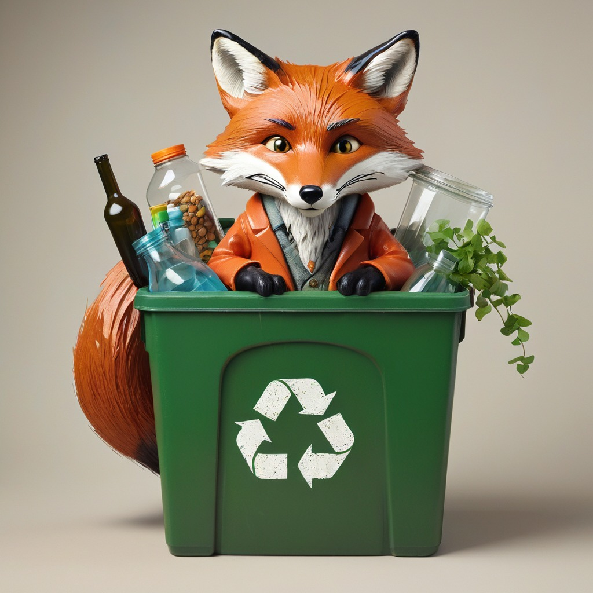

# EcoFuture 🌱

**EcoFuture** é uma iniciativa gratuita focada em educar as pessoas sobre a reciclagem e a importância da sustentabilidade para o planeta. Através de uma plataforma acessível e interativa, incluindo um site e um canal no YouTube, buscamos conscientizar o público sobre práticas de reciclagem e seu impacto ambiental. Nosso objetivo é promover um futuro mais sustentável e engajar a sociedade em ações concretas para a preservação do meio ambiente.

## 🎯 Objetivos

O principal objetivo do EcoFuture é fornecer conteúdo simples, acessível e gratuito sobre reciclagem e sustentabilidade. Queremos que as pessoas, mesmo sem conhecimento prévio, possam aprender práticas sustentáveis de forma confiável e interativa.

## 📊 Metas

- **Especificidade:** O foco principal é a conscientização sobre reciclagem e sustentabilidade.
- **Mensurabilidade:** Monitoraremos as visitas ao site e o engajamento no YouTube para avaliar o impacto e ampliar o alcance.
- **Relevância:** O EcoFuture promove a educação ambiental, facilitando o acesso à informação e incentivando a conscientização social.

## 💡 Justificativa

Diante da crise climática e da degradação ambiental, é urgente educar a população sobre práticas sustentáveis. A reciclagem é uma solução importante para minimizar esses impactos. O EcoFuture se destaca como uma iniciativa necessária para aumentar a conscientização e a adoção dessas práticas.

## ✨ Resultados Esperados

Esperamos aumentar a conscientização sobre a importância da reciclagem e promover uma mudança de comportamento na sociedade. Com isso, acreditamos que o EcoFuture poderá contribuir significativamente para a formação de cidadãos mais informados e comprometidos com a sustentabilidade.

## 📌 Como Contribuir

- Visite nosso [site](https://isaiasg09.github.io/eco-future/) para aprender mais sobre reciclagem e sustentabilidade.
- Acompanhe nosso [canal no YouTube](https://www.youtube.com/@EcoFuture01) para vídeos educativos e tutoriais práticos.
- Participe das discussões e compartilhe suas ideias!

## 📫 Contato

Para dúvidas ou sugestões, entre em contato através do email: reciclaraposo4@gmail.com
